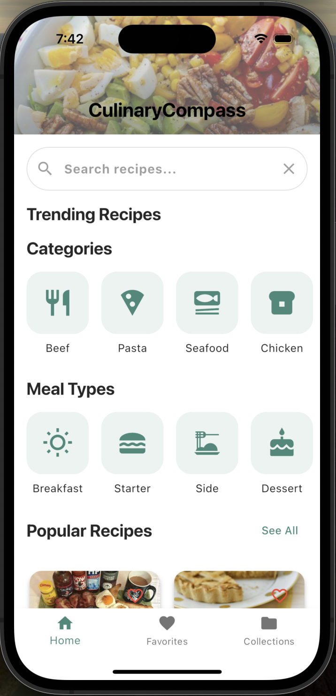
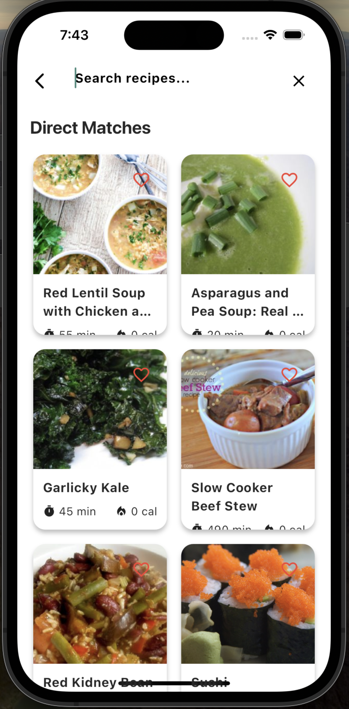

# 🍳 CulinaryCompass

Your personal guide to discovering and cooking delicious recipes from around the world.

## 🌟 About

CulinaryCompass is a modern recipe discovery app that helps you:
- Find recipes based on ingredients you have
- Learn cooking techniques with step-by-step instructions
- Cook hands-free with voice commands
- Save your favorite recipes for offline access
- Explore cuisines from different cultures

## ✨ Features

### 🔍 Advanced Search
- Search by ingredients
- Filter by cooking time
- Filter by difficulty level
- Filter by cuisine type
- Voice search capabilities

### 📱 Smart UI
- Beautiful grid layout for recipes
- Detailed recipe views with step-by-step instructions
- Category-based browsing
- Trending and popular recipes sections
- Dark/Light theme support

### 👨‍🍳 Cooking Mode
- Hands-free voice commands
- Step-by-step instructions
- Keep screen on while cooking
- Voice control commands:
  - Next/Previous step
  - Repeat current step
  - View ingredients
  - Timer controls

### 💾 Offline Support
- Save recipes for offline access
- Automatic caching of viewed recipes
- Search through saved recipes
- Manage favorite recipes

## 🏗️ Architecture

The app follows a clean architecture pattern with:
- Feature-based folder structure
- Riverpod for state management
- Repository pattern for data handling
- Service layer for API communication

### Project Structure

## 🛠️ Built With

- [Flutter](https://flutter.dev/) - UI framework
- [Riverpod](https://riverpod.dev/) - State management
- [TheMealDB API](https://www.themealdb.com/api.php) - Recipe data
- [SharedPreferences](https://pub.dev/packages/shared_preferences) - Local storage
- [Speech to Text](https://pub.dev/packages/speech_to_text) - Voice commands

## 📱 Screenshots

  
   
  
  

### Home Screen
The home screen features trending recipes, categories, and quick access to your favorites.

### Search & Filters
Advanced search with multiple filters helps you find the perfect recipe.

### Recipe Details
Detailed view with ingredients, instructions, and nutritional information.

### Cooking Mode
Hands-free cooking with voice commands and step-by-step guidance.

## 🤝 Contributing

1. Fork the Project
2. Create your Feature Branch (`git checkout -b feature/AmazingFeature`)
3. Commit your Changes (`git commit -m 'Add some AmazingFeature'`)
4. Push to the Branch (`git push origin feature/AmazingFeature`)
5. Open a Pull Request

## 📄 License

This project is licensed under the MIT License - see the [LICENSE](LICENSE) file for details

## 🙏 Acknowledgments

- TheMealDB for their comprehensive recipe API
- Flutter team for the amazing framework
- All contributors who help improve the app

## 📧 Contact

Your Name - [@yourtwitter](https://twitter.com/yourtwitter) - email@example.com

Project Link: [https://github.com/yourusername/recipe_finder](https://github.com/yourusername/recipe_finder)

